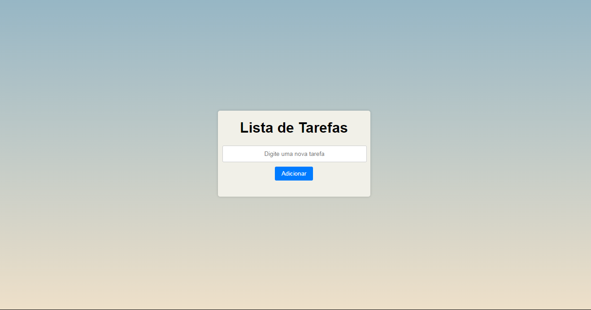

# 📑 To do list // Lista de Tarefas 📑

  

A list of tasks you can approve or remove. // Uma lista de tarefas que você pode aprovar ou remover.

## 🔨 Funcionalidades // Functionalities 🔨

- `Functionalities 1` : Create day to day tasks (not stored) // Criar tarefas do dia a dia (não ficam amarzenadas)
- `Functionalities 2` : Very simple interface // Interface bem simples.
- `Functionalities 3` : For everyday life it is useful not to forget something. // Para o dia a dia é útil para não esquecer algo.

## 🛠️ How to use? // Como usar? 🛠️
- `Acess link // Acesse o link`: https://to-do-list-one-ruddy.vercel.app/
- `Add any task and remove. // Adicione qualquer tarefa e remova.`

 # Developer
 [ Thales Eduardo Pedro](https://github.com/thales32k0) 
    
